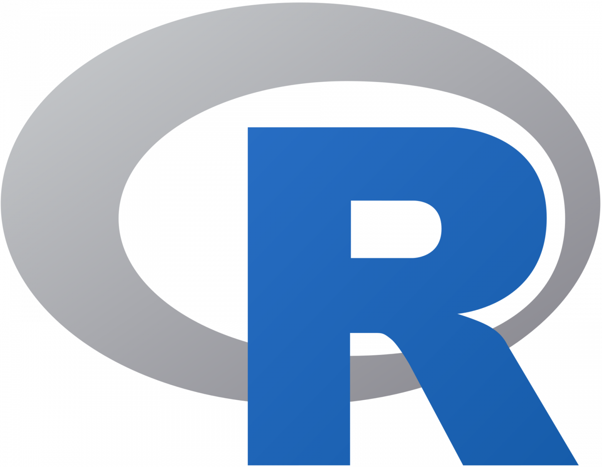
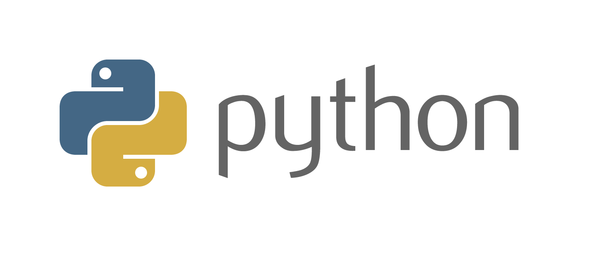
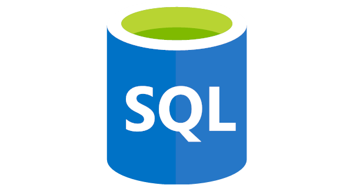
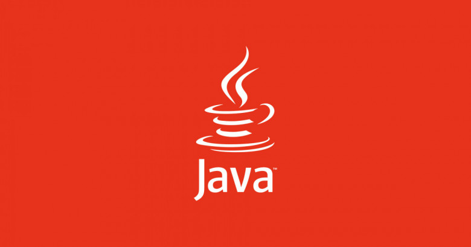
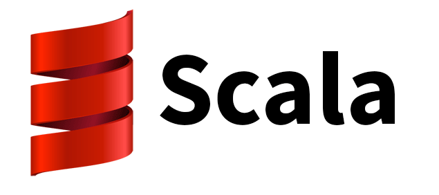
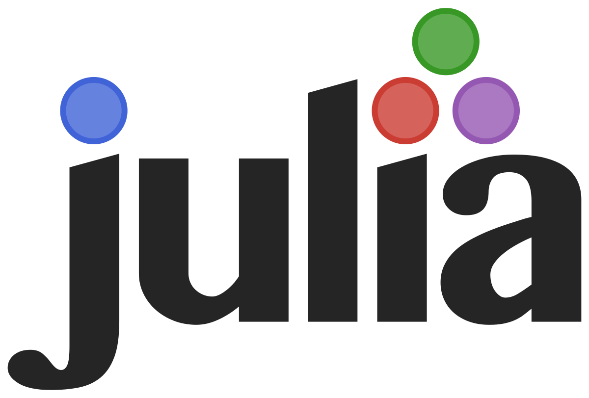
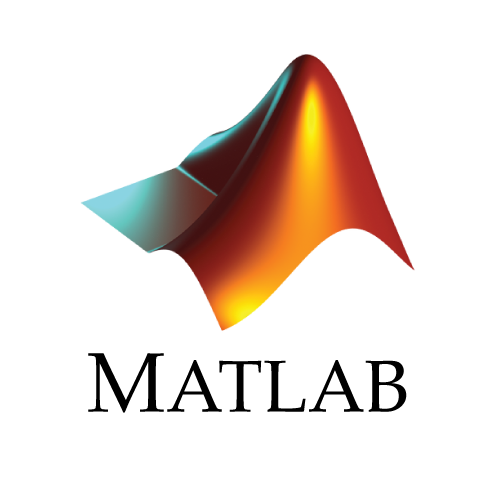

A novice data scientist has the opportunity to choose from a variety of programming languages ​​that will help him master this science faster.

However, no one can tell you exactly which programming language is best suited for this purpose. Your success as a specialist in this field will depend on many factors, and today we will try to consider them, and at the end of the article you can vote for the programming language that you consider the most suitable for working with data.

# Specificity

Be prepared for the fact that as you delve deeper into the field of data science, you will have to “reinvent the wheel” over and over again. In addition, you will need to become fluent in various software packages and modules for your chosen programming language. How well you can learn all this depends, first of all, on the availability of domain-specific software packages for the selected programming language.

# Versatility

The Lead Data Scientist has good all-round programming skills, as well as the ability to perform calculations and analyzes. Much of the day-to-day work in data science is focused on finding and processing original data or correcting data. Unfortunately, no new machine learning packages will help you for these purposes.

# Efficiency

In the fast-paced world of commercial data science, there are plenty of opportunities to get the job you want quickly. However, it is precisely because of the rapid development of the field of data science that technical shortcomings constantly accompany it, and only persistent practice can minimize such shortcomings.

# Performance

In some cases, it is very important to optimize the performance of your code, especially when dealing with large amounts of critical data. However, compiled languages ​​are usually much faster than interpreted ones. Similarly, statically typed languages ​​are significantly more fault tolerant than dynamically typed ones. So the only tradeoff is performance degradation.

To some extent, each of the programming languages ​​below has one parameter in each of two groups: universality - specificity; performance is convenience.

With these basic principles in mind, let's take a look at some of the more popular programming languages ​​that are used in data science. All information about the programming languages ​​below is based on my own observations and experience, as well as the experience of my friends and colleagues.

# **R**

R, which is a direct descendant of the older programming language S, was released back in 1995 and has been getting better ever since. Written in languages ​​such as C and Fortran, this project is now supported by the R Foundation for Statistical Computing.

**License:**

Free

**Benefits:**

- An excellent set of high quality open source domain-specific packages. R has packages at its disposal for just about every quantitative and statistical application imaginable. This includes neural networks, non-linear regression, phylogenetics, building complex diagrams, graphs, and much, much more.
- Together with the basic installation in the appendage, we are given the opportunity to install extensive built-in functions and methods. Also, R handles matrix algebra data nicely.
- The ability to visualize data is an important advantage, along with the ability to use various libraries, such as ggplot2.

**Disadvantages:**

- Low performance. Nothing to say here: R is not a fast language.
- Specificity. R is great for statistical research and data science, but it's not as good when it comes to programming for general purposes.
- Other features. R has several unusual features that can confuse programmers used to working with other languages: indexing starts at 1, multiple assignment operators, non-traditional data structures.

**Our verdict is ideal for initial purposes**

R is a powerful language that has a huge selection of data collection and data visualization applications, and the fact that it is an open source language allows it to garner a large following among developers. It was because of its effectiveness for the original purposes that this programming language managed to achieve wide popularity.

# **Python**

In 1991, Guido van Rossum introduced the Python programming language. Since then, the language has become a hugely popular general-purpose language and is widely used in the data science community. Currently, the main versions are Python 3.6 and Python 2.7.

**License:**

Free

**Benefits:**

- Python is a very popular, widely used general purpose programming language. It has an extensive set of specially designed modules and is widely used by developers. Many online services provide an API for Python.
- Python is very easy to learn. The low barrier to entry makes it an ideal first language for those who are into programming.
- Software packages such as pandas, scikit-learn, and Tensorflow make Python a solid choice for modern machine learning applications.

**Disadvantages:**

- Type safety. Python is a dynamically typed language, which means you have to be careful when working with it. Type mismatch errors (such as passing a string as an argument to a method that expects an integer) can happen from time to time.
- For example, if there are specific goals for statistical analysis and data analysis, then the extensive set of packages of the R language gives it an advantage over Python. In addition, there are faster and safer alternatives to Python among programming languages.

**Our verdict - Easy to**

use Python is a good choice for data science purposes, and this statement holds true for both beginner and advanced levels of work in the field. Much of data science is centered around the ETL (extract-transform-load) process. This feature makes Python an ideal programming language for such purposes. Libraries like Google's Tensorflow make Python a very interesting language to work in the field of machine learning.

# **SQL**

SQL ("Structured Query Language") defines, manages and queries relational databases. The language appeared in 1974 and since then has undergone many modifications, but its basic principles remain unchanged.

**License:**

There are free and paid options.

**Advantages**

- It is very effective when working with queries, updates, as well as when processing relational databases.
- The declarative syntax makes SQL a very readable language. There is no ambiguity about what SELECT name FROM users WHERE age > 18 should do!
- SQL is used very often in various applications, so getting to know it can be very useful. Modules like SQLAlchemy make it easy to integrate SQL with other languages.

**Disadvantages:**

- SQL syntax can seem like a pretty daunting task for those used to imperative programming.
- There are many different variations of SQL such as PostgreSQL, SQLite, MariaDB. All of them are quite different, so there can be no question of any compatibility.

**Our verdict is efficient despite the time**

SQL is more useful as a data processing language than as an advanced analytics tool. However, so many data science processes depend on ETL, and the longevity and efficiency of SQL is yet another proof that every data scientist should know such a language.

# **Java**

Java is an extremely popular general purpose language that runs on the Java Virtual Machine (JVM). It is an abstract computing system that allows for seamless portability across platforms. Currently supported by Oracle Corporation.

**License:**

8th version - free

**Benefits:**

- Versatility. Many modern systems and applications are developed using the Java language. A huge advantage of such a PL is the ability to integrate data science methods directly into the existing code base.
- Strict typing. Type safety is not an empty phrase for Java, and in the case of developing mission-critical applications for working with big data, this feature is more important than ever.
- Java is a high performance, general purpose compiled language. This makes it suitable for writing efficient production ETL code as well as machine learning algorithms using computational tools.

**Disadvantages:**

- The verbosity of the Java language makes it not a good choice for ad hoc analyzes and the development of more specialized statistical applications.
- Java does not have many libraries for advanced statistical methods compared to some domain-specific languages ​​such as R.

**Our verdict is a serious contender for the best language for data science work**

There is a lot to be said for learning Java as a language for data science work. Many companies will appreciate the ability to seamlessly integrate the finished product code into their own code base, and the performance and type safety of Java are its undeniable advantages. However, the disadvantages of such a language include the fact that it does not have a set of specific packages that are available for other languages. Despite this shortcoming, Java is a programming language that you should definitely pay attention to, especially if you already know R or Python.

# **Scala**

The JVM-based Scala programming language was developed by Martin Odersky in 2004. It is a multi-paradigm language that allows for both object-oriented and functional approaches. In addition, the Apache Spark cluster computing framework is written in Scala.

**License:**

Free

**Benefits:**

- Using Scala and Spark, you have the opportunity to work with high-performance cluster computing. Scala is the perfect choice for those who work with large amounts of data.
- Multiparadigmatic. For Scala programmers, both object-oriented and functional programming paradigms are available.
- Scala compiles to Java bytecode and runs on the JVM. This allows it to interoperate with the Java language, making Scala a very powerful general purpose language. In addition, it is also well suited for data science jobs.

**Disadvantages:**

- If you are just going to work with Scala, then be prepared to pretty "break" your head. Your best bet is to download sbt and set up an IDE like Eclipse or IntelliJ with a dedicated Scala plugin.
- There is an opinion that Scala's syntax and type system are quite complex. Thus, programmers who are accustomed to working with dynamic languages ​​such as Python will have a hard time.

 **Our verdict is ideal for working with big data**

If you decide to use cluster computing for working with big data, then Scala + Spark is the perfect solution. Moreover, if you already have experience with Java and other statically typed programming languages, then you will certainly appreciate these features of Scala. However, if your application doesn't deal with large amounts of data that would justify adding all the Scala pieces, you'll likely get better performance using other languages ​​like R or Python.

# **Julia**

Released just over 5 years ago, Julia made an impression on the world of computational methods. The language gained such popularity because several large organizations, including some in the financial industry, began using it for their own purposes almost immediately.

**License:**

Free

**Benefits:**

- Julia is a JIT (just in time) compiled language that achieves good performance. This language is quite simple, it provides for the dynamic typing and scripting capabilities of an interpreted language such as Python.
- Julia was intended for numerical analysis, it can also be considered as a general purpose programming language.
- readability. Many programmers who work with the language consider this feature to be its greatest advantage.

**Disadvantages:**

- Immaturity. Since Julia is a fairly new language, some developers experience instability while working with its packages. However, the core features of the language are considered stable.
- Another sign of the immaturity of the language is the limited number of software packages, as well as a small number of fans among developers. Unlike the established R and Python, the Julia programming language does not have a large number of software packages (yet).

**Our verdict - a language that will show itself**

Yes, the main problem of the Julia language is its youth, but you can't blame it for that. Since Julia was only recently created, it cannot yet compete with its main competitors, Python and R. Be patient and you will find that there are many reasons to pay close attention to this language, which is sure to make outstanding strides in the near future.

# **MATLAB**

MATLAB is a recognized language for numerical calculations, used both for scientific purposes and in industry. It was developed and licensed by MathWorks, a company founded in 1984 with the primary goal of commercializing software.

**License:**

Prices vary depending on the language option you choose

**Benefits:**

- MATLAB, designed for numerical computing, is well suited for using quantitative analysis with complex mathematical requirements such as signal processing, Fourier transforms, matrix algebra, and image processing.
- Data visualization. MATLAB has a number of built-in plotting and charting capabilities.
- MATLAB is often found in many undergraduate courses in the exact sciences, such as physics, engineering, and applied mathematics. Therefore, it is widely used in these areas.

**Disadvantages:**

- Paid license. Regardless of the option you choose (for scientific, personal or company purposes), you will have to fork out for an expensive license. Our advice: check out the free alternative - Octave.
- MATLAB is not the best general purpose programming language.

**Our verdict is the best option for purposes that require significant mathematical calculations**

Due to its wide use in various quantitative calculations for both scientific and industrial purposes, MATLAB has become a worthy option for data science applications. It will come in very handy if your daily goals require intensive, advanced mathematical functionality, in fact, for which MATLAB was designed.

# **Other languages**

There are other popular PLs that may be of interest to data scientists. This section provides a brief overview of them.

# **C++**

Often, C++ is not used in the field of data science. However, it has lightning-fast performance and wide popularity. The main reason why C++ has not gained popularity in the field of data science is its inefficiency for such a purpose.

As one forum member wrote:
“Suppose you are writing code to do some kind of custom analysis that will probably run only once. Now, would you rather spend 30 minutes creating a program that will run for 10 seconds or spend 10 minutes making a program that will run for 1 minute?”

And this guy is right! However, C++ would be an excellent choice for implementing low-level optimized machine learning algorithms.

**Our verdict is not the best choice for daily work, but when it comes to performance...**

# **JavaScript**

As the Node.js platform has evolved over the past few years, the JavaScript programming language has become more and more of a server-side language. However, its capabilities in the field of data science and machine learning are rather modest today (still, don't forget about brain.js and synaptic.js!). The disadvantages of JavaScript include:

- Too early for it to come into play (Node.js is only 8 years old!)...
- The Node.js platform is really fast, but there will always be those who will actively criticize JavaScript.

The undeniable advantages of Node.js include its asynchronous I/O, its growing popularity, and the fact that there are many languages ​​that compile with JavaScript. So it is quite possible that in the near future we will see a useful framework for data science work with the ability to process using ETL in real time. Another question: will it be relevant at that time ...

**Our verdict - there is still a lot of work to be done in order for JavaScript to be considered a worthy language for working in the field of data science**

# **Perl**

Perl is known as the "Swiss army knife of programming languages" because of its versatility as a general-purpose scripting language. It shares many similarities with Python, being a dynamically typed scripting language. But it is still very far from the popularity that Python has in the field of data science.

This is a little surprising, given its applications in areas that use quantitative methods, such as bioinformatics. When it comes to data science, Perl has several drawbacks: it won't quickly become popular in the field, and its syntax is considered unfriendly. In addition, there are no attempts by its developers to create libraries that could be used in the field of data science. And as you and I know: often everything is decided by the right actions at the right time.

**Our verdict is a useful general-purpose scripting language, but it certainly won't get you a data scientist job...**

# **Ruby**

Ruby is another dynamically typed general purpose interpreted language. However, it seems that its creators have no desire to make it suitable for data science jobs, as is the case with Python.

It may seem strange, but all of the above is in one way or another connected with the dominance of Python in the field of scientific research, as well as with the positive feedback from people who write in this language. The more people choose Python, the more modules and frameworks are developed for it, and the more programmers prefer Python. The SciRuby project was created to bring scientific computing functionality, such as matrix algebra, to Ruby. But, despite all these attempts, Python is still in the lead at the moment.

**Our verdict is not exactly the right choice for data science, but knowledge of Ruby will not hurt on your resume**

# **Conclusion**

Well, here we are with you and reviewed a short guide to programming languages ​​that come closest to the field of data science. The important point here is understanding what you need more: the specificity or universality of the language, its convenience or efficiency.

I regularly use R, Python and SQL as my current work is mainly focused on developing existing data pipelines and ETL processes. These languages ​​strike the right balance of generality and efficiency to get the job done, with the ability to use more advanced R statistical packages when needed.

However, maybe you're already pretty good at Java, or you can't wait to try Scala's big data action, or maybe you're crazy about the Julia project.

Or maybe you crammed MATLAB in class at the institute, or would you like to give SciRuby a chance to prove yourself? Yes, you can have hundreds of different reasons! If so, then leave your comment below - because it is really important for us to know the opinion of each of you!

## **Thank you for your attention!**

