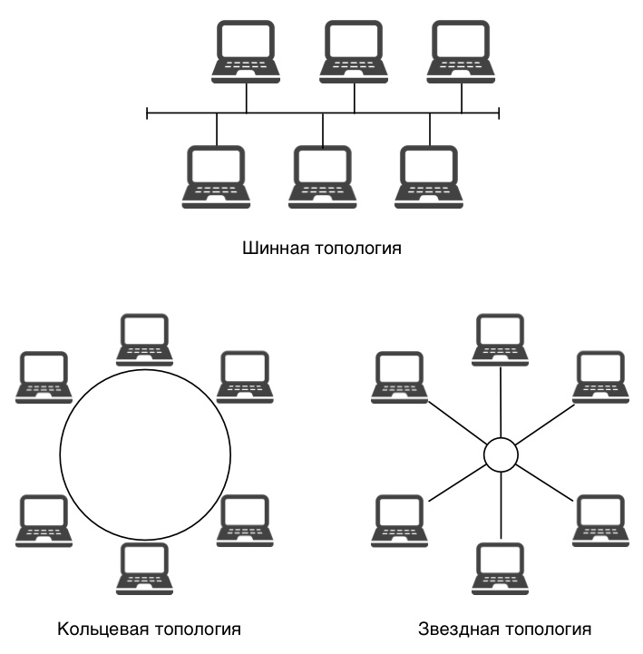

## **My week**

_ _ _

I did a lot of labs beforehand:
- Learned to work in the emacs editor. Studied the basics of programming in the UNIX/Linux OS shell.
- Learned to write small batch files.
- Learned to write more complex batch files using logical control structures and cycles.

Also wrote a paper on "Network topology". This is quite an interesting topic to study.

