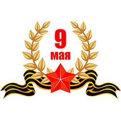

# My week 09.05.2022 - 15.05.2022

_ _ _

This week started with a holiday. This is the day of victory. On this day, I had a fairly rich program. It was on this day that I returned to Moscow after a vacation. On the evening of May 9, there was a stunning solute. 

Then, after a week of rest, I started training. It was necessary to complete and hand over all the debts. I did two more OS labs in advance. On the OS, I learned to work with two editors vi and emacs. 

I also devoted a lot of time to French. 

This week has been quite productive.
