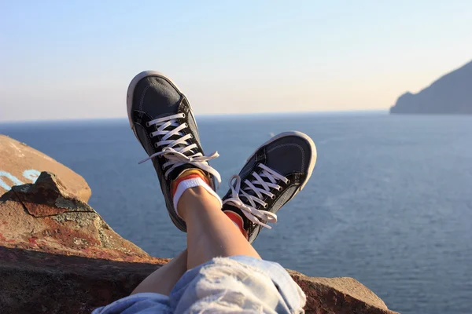

## **Моя неделя**

_ _ _

На этой неделе я поехала домой, отдыхала с семьей. В свободное время занималась саморазвитием, так как заранее сделала лабораторные работы. Я читала литературу по Unix. Было очень весело с моими лучшими друзьями.

Думаю, эта неделя прошла на 100%. Я очень хорошо отдохнула.

